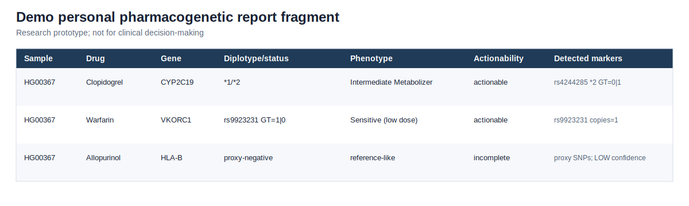
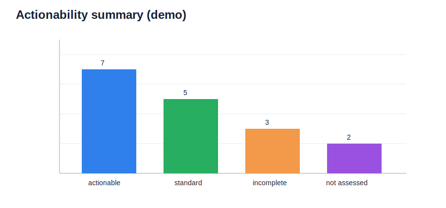

# PharmacoGenetic VCF Interpreter

Прототип фармакогенетического интерпретатора, который по VCF-файлу пациента или группы пациентов и собственной базе фармакогенетических правил формирует персональный отчет о возможных особенностях ответа на лекарственные препараты.

Проект был разработан для хакатон-кейса **«Геномный фармацевт: интерпретатор лекарственного ответа по VCF»**. Логика пайплайна похожа на PharmCAT, но база правил собирается самостоятельно и используется внутри собственного интерпретатора.

> **Research prototype; not for clinical decision-making.**



## Идея проекта

Фармакогенетика изучает, как генетические варианты человека влияют на ответ на лекарства: эффективность терапии, риск побочных реакций и необходимость изменения дозировки.

Между VCF-файлом и клинически понятным выводом есть несколько этапов: нужно найти значимые варианты, сопоставить их с генами и star alleles, определить diplotype, перевести его в функциональный phenotype и связать phenotype с рекомендациями по препаратам.

Этот проект реализует учебный PharmCAT-like пайплайн:

```text
VCF -> variants -> star alleles / diplotypes -> phenotypes -> drug recommendations -> report
```

## Repository layout

```text
.
├── README.md
├── requirements.txt
├── input/
│   ├── Pharma_subset.vcf
│   ├── dataset_full.csv
│   └── PharmaVEP_final.csv
├── notebooks/
│   └── final_version.ipynb
├── src/
│   └── pharmavep_pycharm.py
├── outputs/
│   ├── personal_pharmacogenetic_report_demo.csv
│   ├── variant_coverage_report_demo.csv
│   ├── pharmacogenetic_report_demo.html
│   ├── methods_summary.md
│   └── run_config.json
└── figures/
    ├── report_fragment.svg
    └── actionability_summary.svg
```

The repository contains a **small demo input VCF** and demo outputs. The full 1kG VCF used during development is not committed because of file size.

## What the pipeline does

The pipeline accepts:

- a VCF file with patient genotypes;
- a manually curated pharmacogenetic rule table `dataset_full.csv`;
- a variant annotation table `PharmaVEP_final.csv`;
- optionally, a selected list of drugs for analysis.

It produces:

- a personal pharmacogenetic report for each sample;
- detected pharmacogenetic markers;
- simplified star allele and diplotype calls;
- functional phenotypes;
- drug recommendations;
- variant coverage report;
- HTML report;
- visualizations;
- run metadata and methods summary.

## Pipeline steps

1. **Load inputs**: VCF, pharmacogenetic rules and VEP annotation table.
2. **Normalize rules**: parse drug, gene, rsID, marker type, allele, phenotype, recommendation and source.
3. **Map rsID to coordinates**: use `PharmaVEP_final.csv` to convert rule rsIDs into `CHROM:POS:REF:ALT` keys.
4. **Parse VCF**: scan the VCF and keep only target pharmacogenetic variants.
5. **Call genotypes**: for every sample, read `GT` values such as `0/0`, `0/1`, `1/1`.
6. **Match variants to star alleles**: connect detected variants with rules such as `rs4244285 -> CYP2C19*2`.
7. **Infer diplotypes**: build simplified diplotypes such as `*1/*2`, `*2/*2`, `*1/*17`.
8. **Predict phenotypes**: translate diplotypes into functional phenotypes such as normal, intermediate, poor or rapid metabolizer.
9. **Attach recommendations**: combine phenotype and drug-specific rules to produce dosing, monitoring or alternative therapy recommendations.
10. **Report coverage**: mark whether required variants were found in the VCF or missing.
11. **Generate outputs**: save CSV, HTML, figures, methods and run configuration.

## How star alleles and diplotypes are inferred

The current version uses a **marker-based** approach.

For example, if the rule table contains:

```text
rs4244285 -> CYP2C19*2
```

and the VCF contains this variant for a sample, the pipeline interprets the detected alternative allele as evidence for `CYP2C19*2`.

Genotypes are interpreted as:

- `0/0`: no alternate allele detected;
- `0/1` or `1/0`: one copy of the alternate allele;
- `1/1`: two copies of the alternate allele.

Examples:

- no significant variants -> `*1/*1`;
- one copy of `*2` -> `*1/*2`;
- two copies of `*2` -> `*2/*2`;
- one copy of `*2` and one copy of `*17` -> `*2/*17`.

This is not full haplotype phasing. Complex star alleles, CNVs and structural variants are marked as limitations of the prototype.

## HLA-B and allopurinol

Direct HLA-B*58:01 typing is difficult from a simple SNP VCF because the HLA region is highly polymorphic and structurally complex.

For this prototype, HLA-B*58:01 is handled with a low-confidence proxy SNP approach. The pipeline checks selected proxy SNPs that may be associated with HLA-B*58:01. Results are marked as incomplete because proxy SNPs do not replace direct HLA typing.

## Demo outputs

Demo output files are stored in `outputs/`:

- `personal_pharmacogenetic_report_demo.csv`: compact example of the final patient-level report;
- `variant_coverage_report_demo.csv`: example coverage table;
- `pharmacogenetic_report_demo.html`: example HTML report;
- `methods_summary.md`: method description;
- `run_config.json`: reproducibility metadata.

Figures are stored in `figures/`:



## PharmCAT comparison plan

A suggested validation step is to run a small PharmCAT demo VCF and compare its output with this prototype on the same or similar variants.

Official PharmCAT examples are available here:

- [PharmCAT Examples](https://pharmcat.org/examples/)
- [PharmCAT How It Works](https://pharmcat.org/methods/)

The comparison should focus on:

- which variants were detected;
- which diplotypes were called;
- which phenotypes were assigned;
- whether recommendations are directionally consistent;
- where our prototype differs because it uses marker-based matching instead of full PharmCAT named allele matching.

## Future work

The current implementation is a notebook/prototype. The next engineering step is to package it as a proper command-line tool:

```text
pharmavep run   --vcf input/sample.vcf   --rules input/dataset_full.csv   --annotation input/PharmaVEP_final.csv   --out outputs/
```

Planned improvements:

- full CLI interface;
- cleaner package structure;
- automated tests;
- configuration file support;
- stronger validation of input files;
- optional PharmCAT benchmark mode;
- better support for phasing, CNV and structural variants;
- direct HLA typing integration or external HLA typing input.

## Limitations

This project is a research prototype and is not intended for clinical decision-making.

Main limitations:

- no full haplotype phasing;
- simplified marker-based star allele matching;
- no full CNV or structural variant calling;
- HLA-B*58:01 is estimated through proxy SNPs, not direct HLA typing;
- interpretation depends on the completeness of `dataset_full.csv`;
- absence of a variant in VCF does not always mean absence of a clinically relevant allele;
- recommendations require verification against current CPIC, DPWG, FDA or other clinical sources.

## Short description

PharmCAT-like pharmacogenetic VCF interpreter for hackathon: extracts clinically relevant PGx variants, infers simplified star alleles, diplotypes and phenotypes, and generates personalized drug response reports.
